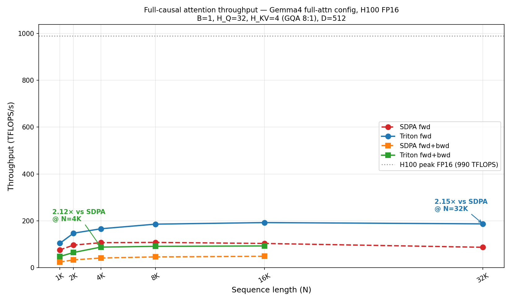
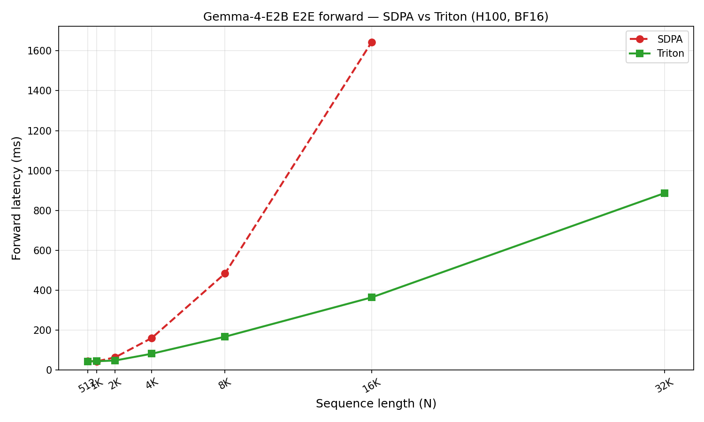
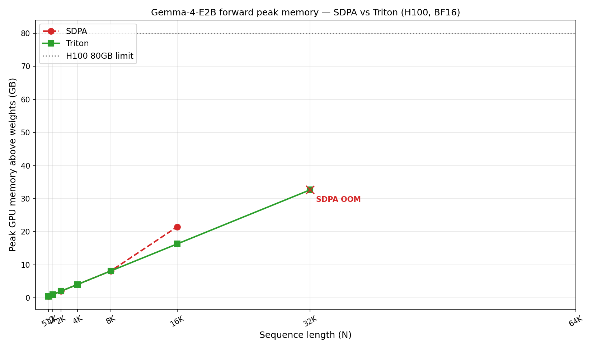
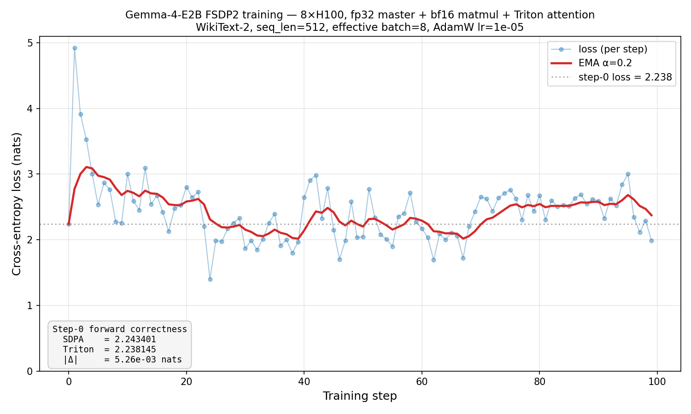

# gemma-triton-flash-attn

Atención Flash Triton lista para usar para HuggingFace transformers. Una sola llamada a función reemplaza el kernel de atención en cada capa de tu modelo — sin subclases, sin cirugía de modelo.

Optimizado para **modelos estilo Gemma4** (GQA con capas alternadas de **causal completo** `HEAD_DIM=512` y **ventana deslizante** `HEAD_DIM=256`), donde las rutas cuDNN / FlashAttention-3 de SDPA no coinciden con la configuración o carecen de soporte SWA.
Cubre tanto las formas de atención **Gemma-4-E2B (denso)** como **Gemma-4-26B-A4B (MoE)** — el router MoE está aguas arriba de la atención, por lo que el kernel ve los mismos tensores Q/K/V y solo difieren los conteos de cabezas / el tamaño de ventana.

## Resultados de un vistazo (H100, GPU única)

| Benchmark | Config | Velocidad máxima / ahorro |
|-----------|--------|---------------------------|
| **Kernel fwd** (causal completo, D=512, GQA 8:1) | N=32K, FP16 | **2.18× vs SDPA** |
| **Kernel fwd+bwd** (causal completo, D=512, GQA 8:1) | N=2K, FP16 | **2.94× vs SDPA** (≥2.43× en todas las N) |
| **Kernel MoE fwd+bwd** (D=512, GQA 8:1) | N=2K, FP16 | **3.45× vs SDPA** |
| **Kernel MoE fwd** (D=256 SWA, slide=1024) | N=16K, FP16 | **9.23× vs SDPA** |
| **Gemma-4-E2B E2E forward** | N=16K, BF16 | **4.47× vs SDPA** |
| **Memoria pico** (Gemma-4-E2B fwd) | N=16K, BF16 | **-24%** (22.0 GB → 16.7 GB) |
| **Contexto máximo ejecutable** (Gemma-4-E2B, H100 80 GB) | — | **32K vs 16K** (SDPA se queda sin memoria en 32K) |
| **Entrenamiento FSDP2 vs SDPA** (Gemma-4-E2B, 8× H100) | 100 pasos, maestro fp32 + matmul bf16 + reducción fp32 | **pérdida media de los últimos 50 pasos dentro de 0.004 nats** de SDPA |
| (bonus) Kernel fwd **D=128** GQA 4:1 | N=32K, FP16 | **1.31× vs SDPA** (421 TFLOPS/s) |
| (bonus) Kernel fwd **D=256 SWA** slide=1024 | N=32K, FP16 | **18.3× vs SDPA** |

### Velocidad — atención causal completa (la configuración de ruta lenta de SDPA)



La capa de atención global de Gemma4 usa `HEAD_DIM=512, H_Q=32, H_KV=4`, que se queda fuera de las rutas rápidas cuDNN / FlashAttention-3 de SDPA — el rendimiento efectivo se limita a ~100 TFLOPS/s en el pase hacia adelante y ~50 TFLOPS/s en fwd+bwd. Nuestro kernel Triton duplica eso hasta ~190 TFLOPS/s fwd (2.18× @ N=32K) y ~115 TFLOPS/s fwd+bwd (**pico 2.94× @ N=2K**, ≥2.43× en cada longitud de secuencia).
Las ganancias de fwd+bwd son mayores porque el trabajo de softmax+rescale (donde `exp2` ayuda más) es una fracción más grande de los kernels backward dQ / dKV.

Ambas implementaciones se cobran por los mismos FLOPs densos causales (`2·B·H·N²·D` fwd, `7·B·H·N²·D` fwd+bwd) — las razones de velocidad en ms y TFLOPS coinciden exactamente. La atención está limitada por el ancho de banda de memoria, por lo que ambas curvas se sitúan bien por debajo del techo de 990 TFLOPS del H100; la victoria está en qué tan apretadamente programamos el tráfico HBM.

El kernel usa `tl.math.exp2` (`log2(e)` plegado en la escala softmax) y un bucle dividido de máscara causal (los bloques fuera de la diagonal saltan la operación de máscara por completo) — ambos tomados de FA2. En D=128 esto nos eleva por encima de SDPA a 421 TFLOPS/s; en D=512 la multiplicación matricial ya es dominante así que las optimizaciones de softmax solo valen unos pocos porcentos. Ver [`docs/optimization_notes.md`](docs/optimization_notes.md).



N corto está dominado por proyecciones lineales (35 capas × 4 proyecciones cada una);
la atención se convierte en el cuello de botella una vez que N ≥ 2K, donde el kernel Triton ensancha la brecha.

### Atención MoE (formas Gemma-4-26B-A4B)

El router MoE está aguas arriba de la atención, por lo que el kernel ve tensores Q/K/V estándar — solo los conteos de cabezas y el tamaño de ventana cambian respecto a E2B. Los tamaños de bloque seleccionan solo por `HEAD_DIM`, así que las mismas configuraciones ajustadas se aplican. Números a nivel de kernel en las dos formas de atención MoE, H100 FP16:

**MoE causal completo** — `D=512, H_Q=16, H_KV=2` (GQA 8:1, 6 capas de 30):

| N | Triton fwd | SDPA fwd | sp fwd | Triton F+B | SDPA F+B | sp F+B |
|---|-----------|----------|--------|------------|----------|--------|
|  1024 |   0.25 ms |   0.25 ms | 1.02× |   1.29 ms |    3.48 ms | 2.69× |
|  2048 |   0.64 ms |   0.79 ms | 1.24× |   2.64 ms |    9.12 ms | **3.45×** |
|  4096 |   1.85 ms |   2.67 ms | 1.44× |   9.15 ms |   26.48 ms | 2.89× |
|  8192 |   6.46 ms |  10.27 ms | 1.59× |  33.94 ms |   89.29 ms | 2.63× |
| 16384 |  24.21 ms |  43.51 ms | 1.80× | 132.13 ms |  322.82 ms | 2.44× |
| 32768 |  98.52 ms | 202.73 ms | **2.06×** | 525.62 ms | 1277.73 ms | 2.43× |

La misma historia que E2B causal completo: SDPA no tiene ruta rápida para `D=512`, así que Triton fwd escala de 1.02× en N=1K a 2.06× en N=32K. Fwd+bwd ya alcanza **3.45× en N=2K** y se mantiene ≥2.43× en todas partes — el trabajo de softmax/rescale hacia atrás es donde `exp2` obtiene más beneficios.

**MoE deslizante** — `D=256, H_Q=16, H_KV=8, slide=1024` (GQA 2:1, 24 capas de 30):

| N | Triton fwd | SDPA fwd | sp fwd | Triton F+B | SDPA F+B | sp F+B |
|---|-----------|----------|--------|------------|----------|--------|
|  1024 |  0.10 ms |  0.10 ms | 0.99× |   0.40 ms |   0.36 ms | 0.89× |
|  2048 |  0.18 ms |  0.15 ms | 0.87× |   0.63 ms |   0.58 ms | 0.92× |
|  4096 |  0.27 ms |  0.63 ms | 2.31× |   1.07 ms |   2.41 ms | 2.25× |
|  8192 |  0.47 ms |  1.08 ms | 2.28× |   2.02 ms |   5.19 ms | 2.57× |
| 16384 |  0.85 ms |  7.89 ms | **9.23×** |   4.00 ms |  30.04 ms | 7.51× |
| 32768 |  1.89 ms | 15.16 ms | 8.02× |   8.41 ms |  79.53 ms | **9.46×** |

En N ≤ slide (1024 / 2048) SDPA aún enruta a FlashAttention-3 (la ventana cubre toda la secuencia, por lo que degenera a causal completo) y nos iguala.
Una vez que N > slide SDPA retrocede y la brecha se abre — 9.23× en N=16K fwd, 9.46× en N=32K fwd+bwd.

Números en bruto: [`benchmarks/moe_attn_sweep.json`](benchmarks/moe_attn_sweep.json).
Nota: las aceleraciones del kernel MoE ≠ aceleraciones E2E MoE — en el extremo, la atención es solo ~3% del tiempo CUDA en la ruta Triton, por lo que las ganancias E2E se maximizan alrededor de 2.3× (dominado por RoPE / reshape / multiplicación matricial del experto MoE). Ver
[`docs/optimization_notes.md`](docs/optimization_notes.md).

### Memoria



En N corto ambas rutas están empatadas (SDPA usa su propio backend flash). En
N=16K SDPA comienza a materializar la memoria auxiliar de atención y Triton ahorra 5.3 GB;
en N=32K SDPA se queda sin memoria por completo mientras Triton aún cabe en
33 GB por encima de los pesos del modelo.

## Entrenamiento E2E (FSDP2, 8× H100)

El pase hacia atrás del kernel funciona bajo entrenamiento real en precisión mixta
(pesos maestros fp32 / estados fp32 AdamW / matmul bf16 / reducción fp32 de gradientes)
repartidos en 8 H100s con FSDP2 `fully_shard()` por capa.
Mismo modelo, mismos datos, misma inicialización del optimizador — solo el kernel de atención difiere:



**Corrección de forward en el paso 0**: con pesos e identicos inputs, Triton
y SDPA coinciden en **|Δ| = 5.3e-03 nats** — dentro de la tolerancia de redondeo bf16.

**100 pasos de entrenamiento** en WikiText-2: las dos trayectorias de pérdida siguen de cerca durante todo el proceso, terminando dentro de **0.004 nats** la una de la otra en la media de los últimos 50 pasos (SDPA = 2.396, Triton = 2.391). El promedio de |SDPA − Triton| por paso es 0.021 nats (máximo 0.156), sin divergencia en 100 actualizaciones AdamW. El ruido por paso es variación de dificultad de fragmentos (cada paso es un fragmento diferente de WikiText), no inestabilidad de entrenamiento.

La receta de precisión en cada rango:

| | dtype | almacenamiento |
|---|---|---|
| Pesos maestros | fp32 | repartidos en 8 GPUs |
| Estados AdamW (`exp_avg`, `exp_avg_sq`) | fp32 | repartidos |
| Multiplicación matricial forward / backward | bf16 | FSDP2 convierte parámetros en all-gather |
| Reducción de gradientes (reduce-scatter) | **fp32** | `reduce_dtype` — evita error de suma bf16 en 8+ rangos |
| Actualización del optimizador | fp32 | parámetros elevados de precisión al desrepartir |

### Gemma-4 + FSDP2 por capa: un problema

El gancho `pre_forward` por módulo de FSDP2 ejecuta `tree_flatten`/`tree_unflatten`
en kwargs para registrar un gancho post-backward en tensores que requieren gradiente.
`dict` es un contenedor pytree, por lo que unflatten reconstruye un *nuevo* dict vacío —
`shared_kv_states` de Gemma-4 pierde identidad en cada límite de capa, y las capas posteriores al punto de compartición de KV lanzan `KeyError`.

Solución de una línea: llamar a `patch_gemma4_shared_kv_states_for_fsdp2()` en el momento de importar,
que intercambia el dict por un contenedor opaco de pytree cuya identidad sobrevive a flatten/unflatten.
Forward es idéntico antes y después del parche.

```python
from gemma_triton_flash_attn import (
    register_triton_attention,
    patch_gemma4_shared_kv_states_for_fsdp2,
)
from torch.distributed.fsdp import fully_shard, MixedPrecisionPolicy

register_triton_attention()
patch_gemma4_shared_kv_states_for_fsdp2()              # requerido para FSDP2 por capa
model = AutoModelForCausalLM.from_pretrained("google/gemma-4-E2B",
                                             dtype="float32")
model.config._attn_implementation = "triton_gqa"
model.config.text_config._attn_implementation = "triton_gqa"

mp = MixedPrecisionPolicy(param_dtype=torch.bfloat16, reduce_dtype=torch.float32,
                          cast_forward_inputs=False)
for layer in model.model.language_model.layers:
    fully_shard(layer, mp_policy=mp)
fully_shard(model, mp_policy=mp)
```

Prueba ejecutable completa: [`tests/gemma4_integration/test_training_fsdp2.py`](tests/gemma4_integration/test_training_fsdp2.py).

## Inicio rápido: intercambiar atención en 3 líneas

```python
from gemma_triton_flash_attn import register_triton_attention
from transformers import AutoModelForCausalLM

register_triton_attention()                                   # 1. registrar "triton_gqa"
model = AutoModelForCausalLM.from_pretrained(
    "google/gemma-4-E2B", dtype="bfloat16", device_map="cuda")
model.config._attn_implementation = "triton_gqa"              # 2. optar por él
if hasattr(model.config, "text_config"):                      # 3. optar en configs anidadas
    model.config.text_config._attn_implementation = "triton_gqa"

# Cada capa de atención ahora usa el kernel Triton. Forward / backward / generate
# siguen funcionando — el resto del stack de transformers queda intacto.
out = model(input_ids)
```

**usuarios de transformers 5.5.4**: llamar a
`patch_transformers_5_5_4_flash_attn_key()` una vez antes de cargar cualquier config para
solucionar el error `KeyError: 'flash_attn'` aguas arriba
([detalles](docs/integration.md#transformers-554-keyerror-workaround)).

## Secuencias de longitud variable (empaquetadas)

Para entrenamiento de longitud mixta (chat, código, preentrenamiento empaquetado), `flash_attn_gqa_varlen`
toma un flujo empaquetado de tokens y un tensor de desplazamientos cu_seqlens — sin relleno,
así que el coste de atención escala con tokens reales en lugar de `B * max_seqlen`. API compatible con FA2.

```python
import torch
from gemma_triton_flash_attn import flash_attn_gqa_varlen

seqlens = torch.tensor([512, 1024, 256, 2048])                        # 4 muestras
cu = torch.zeros(5, dtype=torch.int32, device="cuda")
cu[1:] = seqlens.cumsum(0).to(torch.int32).cuda()
total = int(seqlens.sum())
max_len = int(seqlens.max())

q = torch.randn(total, 8, 128, dtype=torch.bfloat16, device="cuda")   # (tokens, H_Q, D)
k = torch.randn(total, 2, 128, dtype=torch.bfloat16, device="cuda")   # (tokens, H_KV, D)
v = torch.randn(total, 2, 128, dtype=torch.bfloat16, device="cuda")

out = flash_attn_gqa_varlen(q, k, v, cu, cu, max_len, max_len,
                            causal=True, window_size=0)               # o window_size=1024 para SWA
```

Medido en H200 (longitudes con distribución Zipf, Triton 3.2):

| D | GQA | total | pad% | aceleración varlen vs agrupado con relleno |
|--:|:---:|------:|-----:|--------------------------------------------:|
| 128 | 8:1 | 32K | 93% | **24.76×** |
| 128 | 32:4 | 16K | 87% | 12.52× |
| 256 | 8:2 | 8K | 76% | **5.04×** |
| 512 | 32:4 | 4K | 58% | **3.27×** |

Ver [`docs/varlen.md`](docs/varlen.md) para la API completa y notas de diseño.

## Por qué existe este paquete

SDPA de PyTorch (cuDNN / FlashAttention-3) está muy optimizado para valores estándar
de `HEAD_DIM` (64, 128, 256). Las dos variantes de atención de Gemma4 caen
fuera de la ruta rápida:

| Variante | Capa | HEAD_DIM | H_Q / H_KV | Ratio GQA | Ventana | Estado SDPA |
|---------|-------|----------|------------|-----------|--------|-------------|
| E2B denso | global  | **512** | 32 / 4 | 8:1 | — | fallback genérico, lento |
| E2B denso | deslizante | 256 | 32 / 16 | 2:1 | 512 | rápido en N corto, **sin soporte SWA** |
| 26B-A4B MoE | global  | **512** | 16 / 2 | 8:1 | — | fallback genérico, lento |
| 26B-A4B MoE | deslizante | 256 | 16 / 8 | 2:1 | 1024 | rápido en N corto, **sin soporte SWA** |

Los tamaños de bloque del kernel seleccionan solo por `HEAD_DIM` (los conteos de cabezas y `slide_size`
son parámetros en tiempo de ejecución), así que las mismas configuraciones ajustadas se aplican en E2B y MoE.
Para modelos que alternan estas (Gemma4 denso, Gemma4 MoE), este kernel es típicamente 1.3×–4.5× más rápido E2E en H100.

## Instalación

```bash
git clone <repo>
cd kernel
pip install -e .
```

Requisitos: `torch>=2.0`, `triton>=3.0`, GPU CUDA (probado en H100).

Para las pruebas de integración (descarga real de Gemma-4-E2B):

```bash
pip install -r requirements.txt          # transformers 5.5.4, accelerate, etc.
```

## Ejecutando las pruebas

```bash
# 1) Prueba de adaptador — 24 casos (GQA × SWA × D), segundos
python tests/gemma4_integration/test_adapter.py

# 2) Gemma-4-E2B E2E real — descarga 5 GB en la primera ejecución
export HF_TOKEN="hf_..."                  # Gemma está restringido en HF
python tests/gemma4_integration/test_gemma4.py --seq-len 1024

# 3) Prueba de entrenamiento GPU única — 10 pasos AdamW en WikiText-2
python tests/gemma4_integration/test_training.py --steps 10

# 4) Entrenamiento FSDP2 en precisión mixta — 8 GPUs, reparto por capa
torchrun --standalone --nproc-per-node=8 \
    tests/gemma4_integration/test_training_fsdp2.py --steps 100
```

Matriz completa de pruebas y salidas esperadas: [`docs/tests.md`](docs/tests.md).

## Lo que NO soporta

- ALiBi o inyección de sesgo posicional
- `softcap` (lanza `NotImplementedError` en el adaptador)
- Dropout de atención
- `HEAD_DIM` fuera del rango 64–512
- Dispositivos distintos de CUDA

## Documentación

| Tema | Archivo |
|-------|------|
| Cómo funciona el adaptador de HF | [`docs/integration.md`](docs/integration.md) |
| Referencia de API pública | [`docs/api.md`](docs/api.md) |
| Arquitectura y mapa de kernel | [`docs/architecture.md`](docs/architecture.md) |
| Notas de optimización (aciertos + callejones sin salida) | [`docs/optimization_notes.md`](docs/optimization_notes.md) |
| Conjunto de pruebas | [`docs/tests.md`](docs/tests.md) |

## Reproduciendo los benchmarks

```bash
export HF_TOKEN="hf_..."
python benchmarks/run_final_benchmark.py       # ejecución de 30 min, produce results.json + 3 PNGs
python benchmarks/replot.py                    # regenerar gráficos desde datos en caché
python benchmarks/plot_training_loss.py        # regenerar PNG de pérdida de entrenamiento desde JSON en caché
```

Los números en bruto viven en [`benchmarks/results.json`](benchmarks/results.json) y
[`benchmarks/training_loss_fsdp2.json`](benchmarks/training_loss_fsdp2.json).
