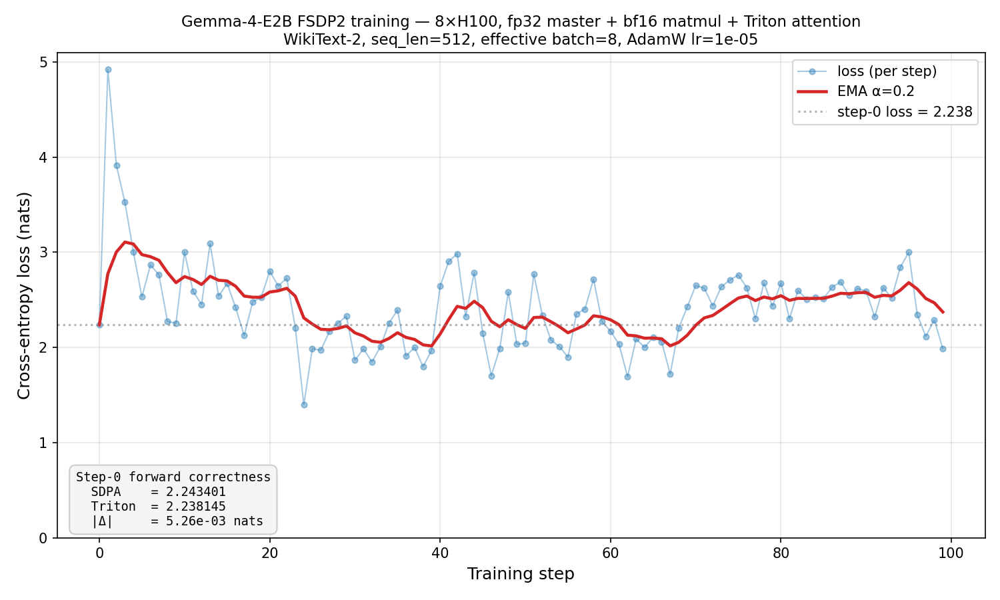

# gemma-triton-flash-attn

Drop-in Triton Flash Attention for HuggingFace transformers. One function
call replaces the attention kernel in every layer of your model — no
subclassing, no model surgery.

Optimised for **Gemma4-style models** (GQA with alternating **full causal**
`HEAD_DIM=512` and **sliding window** `HEAD_DIM=256` layers), where SDPA's
cuDNN / FlashAttention-3 paths either miss the config or lack SWA support.
Covers both **Gemma-4-E2B (dense)** and **Gemma-4-26B-A4B (MoE)** attention
shapes — the MoE router is upstream of attention, so the kernel sees the
same Q/K/V tensors and only the head counts / window size differ.

## Results at a glance (H100, single GPU)

| Benchmark | Config | Peak speedup / saving |
|-----------|--------|-----------------------|
| **Kernel fwd** (full causal, D=512, GQA 8:1) | N=32K, FP16 | **2.18× vs SDPA** |
| **Kernel fwd+bwd** (full causal, D=512, GQA 8:1) | N=2K, FP16 | **2.94× vs SDPA** (≥2.43× across all N) |
| **MoE kernel fwd+bwd** (D=512, GQA 8:1) | N=2K, FP16 | **3.45× vs SDPA** |
| **MoE kernel fwd** (D=256 SWA, slide=1024) | N=16K, FP16 | **9.23× vs SDPA** |
| **Gemma-4-E2B E2E forward** | N=16K, BF16 | **4.47× vs SDPA** |
| **Peak memory** (Gemma-4-E2B fwd) | N=16K, BF16 | **-24%** (22.0 GB → 16.7 GB) |
| **Max runnable context** (Gemma-4-E2B, 80 GB H100) | — | **32K vs 16K** (SDPA OOMs at 32K) |
| **FSDP2 training** (Gemma-4-E2B, 8× H100) | 100 steps, BF16 matmul / FP32 master | **PASS** — no NaN, \|Δ\| vs SDPA = 5.3e-03 nats |
| (bonus) Kernel fwd **D=128** GQA 4:1 | N=32K, FP16 | **1.31× vs SDPA** (421 TFLOPS/s) |
| (bonus) Kernel fwd **D=256 SWA** slide=1024 | N=32K, FP16 | **18.3× vs SDPA** |

### Speed — full causal attention (the SDPA slow-path config)


Gemma4's global attention layer uses `HEAD_DIM=512, H_Q=32, H_KV=4`, which
falls off SDPA's cuDNN / FlashAttention-3 fast-paths — effective throughput
caps at ~100 TFLOPS/s on the forward pass and ~50 TFLOPS/s on fwd+bwd. Our
Triton kernel doubles that to ~190 TFLOPS/s fwd (2.18× @ N=32K) and ~115
TFLOPS/s fwd+bwd (**peak 2.94× @ N=2K**, ≥2.43× at every sequence length).
Fwd+bwd wins are larger because the softmax+rescale work (where `exp2`
helps most) is a bigger fraction of the backward dQ / dKV kernels.

Both implementations are charged for the same dense-causal FLOPs
(`2·B·H·N²·D` fwd, `7·B·H·N²·D` fwd+bwd) — speedup ratios in ms and TFLOPS
match exactly. Attention is memory-bandwidth-bound, so both curves sit well
below the 990 TFLOPS H100 ceiling; the win is in how tightly we schedule
HBM traffic.

The kernel uses `tl.math.exp2` (folded `log2(e)` into the softmax scale) and
a split-loop causal mask (off-diagonal blocks skip the mask op entirely) —
both borrowed from FA2. At D=128 this lifts us past SDPA to 421 TFLOPS/s;
at D=512 the matmul is already dominant so the softmax optimizations are
worth only a few percent. See [`docs/optimization_notes.md`](docs/optimization_notes.md).


Short N is dominated by linear projections (35 layers × 4 projs each);
attention becomes the bottleneck once N ≥ 2K, where the Triton kernel
widens the gap.

### MoE attention (Gemma-4-26B-A4B shapes)

The MoE router is upstream of attention, so the kernel sees standard Q/K/V
tensors — only the head counts and window size change from E2B. Block sizes
select on `HEAD_DIM` alone, so the same tuned configs apply. Kernel-level
numbers on the two MoE attention shapes, H100 FP16:

**MoE full causal** — `D=512, H_Q=16, H_KV=2` (GQA 8:1, 6 layers of 30):

| N | Triton fwd | SDPA fwd | fwd sp | Triton F+B | SDPA F+B | F+B sp |
|---|-----------|----------|--------|------------|----------|--------|
|  1024 |   0.25 ms |   0.25 ms | 1.02× |   1.29 ms |    3.48 ms | 2.69× |
|  2048 |   0.64 ms |   0.79 ms | 1.24× |   2.64 ms |    9.12 ms | **3.45×** |
|  4096 |   1.85 ms |   2.67 ms | 1.44× |   9.15 ms |   26.48 ms | 2.89× |
|  8192 |   6.46 ms |  10.27 ms | 1.59× |  33.94 ms |   89.29 ms | 2.63× |
| 16384 |  24.21 ms |  43.51 ms | 1.80× | 132.13 ms |  322.82 ms | 2.44× |
| 32768 |  98.52 ms | 202.73 ms | **2.06×** | 525.62 ms | 1277.73 ms | 2.43× |

Same story as E2B full causal: SDPA has no fast-path for `D=512`, so Triton
fwd scales from 1.02× at N=1K to 2.06× at N=32K. Fwd+bwd already hits
**3.45× at N=2K** and stays ≥2.43× everywhere — the backward softmax/rescale
work is where `exp2` earns the most.

**MoE sliding** — `D=256, H_Q=16, H_KV=8, slide=1024` (GQA 2:1, 24 layers of 30):

| N | Triton fwd | SDPA fwd | fwd sp | Triton F+B | SDPA F+B | F+B sp |
|---|-----------|----------|--------|------------|----------|--------|
|  1024 |  0.10 ms |  0.10 ms | 0.99× |   0.40 ms |   0.36 ms | 0.89× |
|  2048 |  0.18 ms |  0.15 ms | 0.87× |   0.63 ms |   0.58 ms | 0.92× |
|  4096 |  0.27 ms |  0.63 ms | 2.31× |   1.07 ms |   2.41 ms | 2.25× |
|  8192 |  0.47 ms |  1.08 ms | 2.28× |   2.02 ms |   5.19 ms | 2.57× |
| 16384 |  0.85 ms |  7.89 ms | **9.23×** |   4.00 ms |  30.04 ms | 7.51× |
| 32768 |  1.89 ms | 15.16 ms | 8.02× |   8.41 ms |  79.53 ms | **9.46×** |

At N ≤ slide (1024 / 2048) SDPA still routes to FlashAttention-3 (the window
covers the whole sequence, so it degenerates to full causal) and matches us.
Once N > slide SDPA falls back and the gap snaps open — 9.23× at N=16K fwd,
9.46× at N=32K fwd+bwd.

Raw numbers: [`benchmarks/moe_attn_sweep.json`](benchmarks/moe_attn_sweep.json).
Note: MoE kernel speedups ≠ MoE E2E speedups — end-to-end, attention is
only ~3% of CUDA time in the Triton path at N≤8K, so E2E gains max out
around 2.3× (dominated by RoPE / reshape / MoE expert matmul). See
[`docs/optimization_notes.md`](docs/optimization_notes.md).

### Memory


At short N both paths are tied (SDPA uses its own flash backend). At
N=16K SDPA starts materialising attention scratch and Triton saves 5.3 GB;
at N=32K SDPA runs out of memory entirely while Triton still fits in
33 GB above the model weights.

## End-to-end training (FSDP2, 8× H100)

The kernel's backward pass works under real mixed-precision training
(fp32 master weights / fp32 AdamW states / bf16 matmul) sharded across
8 H100s with FSDP2 per-layer `fully_shard()`:



**Step-0 forward correctness**: SDPA vs Triton on identical weights and
inputs gives **|Δ| = 5.3e-03 nats** — well within bf16 rounding tolerance.
**100 training steps** on WikiText-2 complete with no NaN, loss stays
bounded around the initial 2.24-nat level (per-step variance is
chunk-difficulty noise — each step is a different WikiText chunk, not
the same batch re-trained). The EMA curve shows no divergence.

The precision recipe on each rank:

| | dtype | storage |
|---|---|---|
| Master weights | fp32 | sharded across 8 GPUs |
| AdamW states (`exp_avg`, `exp_avg_sq`) | fp32 | sharded |
| Forward / backward matmul | bf16 | FSDP2 casts on all-gather |
| Gradient reduce-scatter | bf16 | `reduce_dtype` |
| Optimizer update | fp32 | (params upcast on unshard) |

### Gemma-4 + FSDP2 per-layer sharding: one gotcha

FSDP2's per-module `pre_forward` hook runs `tree_flatten`/`tree_unflatten`
on kwargs to register a post-backward hook on grad-requiring tensors.
`dict` is a pytree container, so unflatten rebuilds it as a *new* empty
dict — Gemma-4's cross-layer `shared_kv_states` loses identity at every
layer boundary, and layers past the KV-sharing point raise `KeyError`.

One-line fix: call `patch_gemma4_shared_kv_states_for_fsdp2()` at import
time, which swaps the dict for a pytree-opaque holder whose identity
survives flatten/unflatten. Forward is bit-identical pre/post patch.

```python
from gemma_triton_flash_attn import (
    register_triton_attention,
    patch_gemma4_shared_kv_states_for_fsdp2,
)
from torch.distributed.fsdp import fully_shard, MixedPrecisionPolicy

register_triton_attention()
patch_gemma4_shared_kv_states_for_fsdp2()              # required for per-layer FSDP2
model = AutoModelForCausalLM.from_pretrained("google/gemma-4-E2B",
                                             dtype="float32")
model.config._attn_implementation = "triton_gqa"
model.config.text_config._attn_implementation = "triton_gqa"

mp = MixedPrecisionPolicy(param_dtype=torch.bfloat16, reduce_dtype=torch.bfloat16,
                          cast_forward_inputs=False)
for layer in model.model.language_model.layers:
    fully_shard(layer, mp_policy=mp)
fully_shard(model, mp_policy=mp)
```

Full runnable test: [`tests/gemma4_integration/test_training_fsdp2.py`](tests/gemma4_integration/test_training_fsdp2.py).

## Quickstart: swap attention in 3 lines

```python
from gemma_triton_flash_attn import register_triton_attention
from transformers import AutoModelForCausalLM

register_triton_attention()                                   # 1. register "triton_gqa"
model = AutoModelForCausalLM.from_pretrained(
    "google/gemma-4-E2B", dtype="bfloat16", device_map="cuda")
model.config._attn_implementation = "triton_gqa"              # 2. opt in
if hasattr(model.config, "text_config"):                      # 3. opt in nested configs
    model.config.text_config._attn_implementation = "triton_gqa"

# Every attention layer now uses the Triton kernel. Forward / backward / generate
# all continue to work — the rest of the transformers stack is untouched.
out = model(input_ids)
```

**transformers 5.5.4 users**: call
`patch_transformers_5_5_4_flash_attn_key()` once before any config load to
work around the upstream `KeyError: 'flash_attn'` bug
([details](docs/integration.md#transformers-554-keyerror-workaround)).

## Why this package

PyTorch SDPA (cuDNN / FlashAttention-3) is heavily optimised for standard
`HEAD_DIM` values (64, 128, 256). Gemma4's two attention variants fall
outside the fast path:

| Variant | Layer | HEAD_DIM | H_Q / H_KV | GQA ratio | Window | SDPA status |
|---------|-------|----------|------------|-----------|--------|-------------|
| E2B dense | global  | **512** | 32 / 4 | 8:1 | — | generic fallback, slow |
| E2B dense | sliding | 256 | 32 / 16 | 2:1 | 512 | fast at short N, **no SWA support** |
| 26B-A4B MoE | global  | **512** | 16 / 2 | 8:1 | — | generic fallback, slow |
| 26B-A4B MoE | sliding | 256 | 16 / 8 | 2:1 | 1024 | fast at short N, **no SWA support** |

Kernel block sizes select on `HEAD_DIM` only (head counts and `slide_size`
are runtime params), so the same tuned configs apply across E2B and MoE.
For models that alternate these (Gemma4 dense, Gemma4 MoE), this kernel is
typically 1.3×–4.5× faster end-to-end on H100.

## Installation

```bash
git clone <repo>
cd kernel
pip install -e .
```

Requires: `torch>=2.0`, `triton>=3.0`, CUDA GPU (tested on H100).

For the integration tests (real Gemma-4-E2B download):

```bash
pip install -r requirements.txt          # transformers 5.5.4, accelerate, etc.
```

## Running the tests

```bash
# 1) Adapter unit test — 24 cases (GQA × SWA × D), seconds
python tests/gemma4_integration/test_adapter.py

# 2) Real Gemma-4-E2B end-to-end — downloads 5 GB on first run
export HF_TOKEN="hf_..."                  # Gemma is gated on HF
python tests/gemma4_integration/test_gemma4.py --seq-len 1024

# 3) Single-GPU training test — 10 AdamW steps on WikiText-2
python tests/gemma4_integration/test_training.py --steps 10

# 4) FSDP2 mixed-precision training — 8 GPUs, per-layer sharding
torchrun --standalone --nproc-per-node=8 \
    tests/gemma4_integration/test_training_fsdp2.py --steps 100
```

Full test matrix and expected outputs: [`docs/tests.md`](docs/tests.md).

## What it does NOT support

- Variable-length sequences / padding mask
- ALiBi or positional bias injection
- `softcap` (raises `NotImplementedError` in the adapter)
- Attention dropout
- `HEAD_DIM` outside 64–512 range
- Devices other than CUDA

## Documentation

| Topic | File |
|-------|------|
| How the HF adapter works | [`docs/integration.md`](docs/integration.md) |
| Public API reference | [`docs/api.md`](docs/api.md) |
| Architecture & kernel map | [`docs/architecture.md`](docs/architecture.md) |
| Optimisation notes (wins + dead ends) | [`docs/optimization_notes.md`](docs/optimization_notes.md) |
| Test suite | [`docs/tests.md`](docs/tests.md) |

## Reproducing the benchmarks

```bash
export HF_TOKEN="hf_..."
python benchmarks/run_final_benchmark.py       # 30-min run, produces results.json + 3 PNGs
python benchmarks/replot.py                    # regenerate plots from cached data
python benchmarks/plot_training_loss.py        # regenerate training-loss PNG from cached JSON
```

Raw numbers live in [`benchmarks/results.json`](benchmarks/results.json) and
[`benchmarks/training_loss_fsdp2.json`](benchmarks/training_loss_fsdp2.json).
