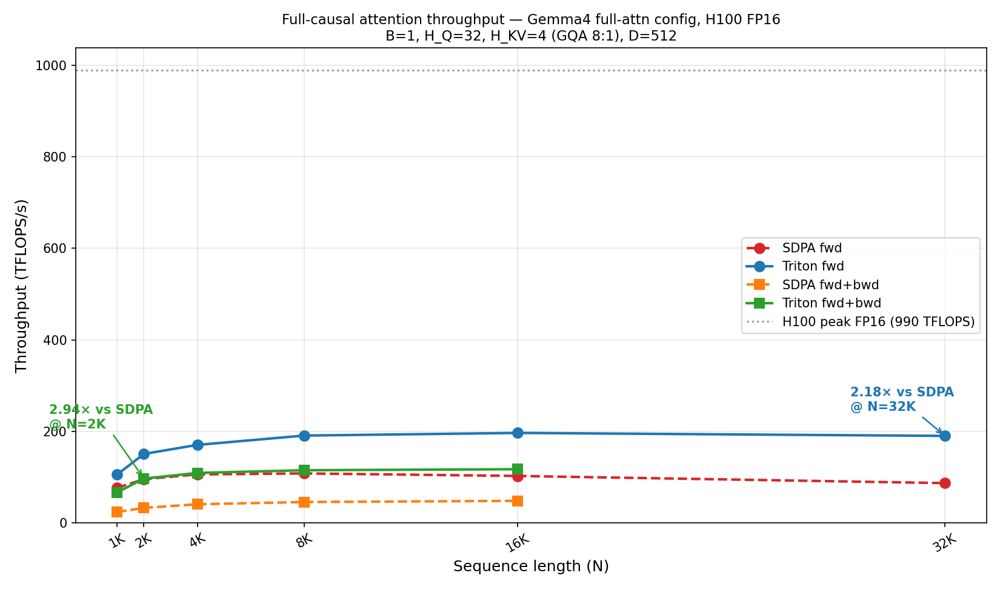
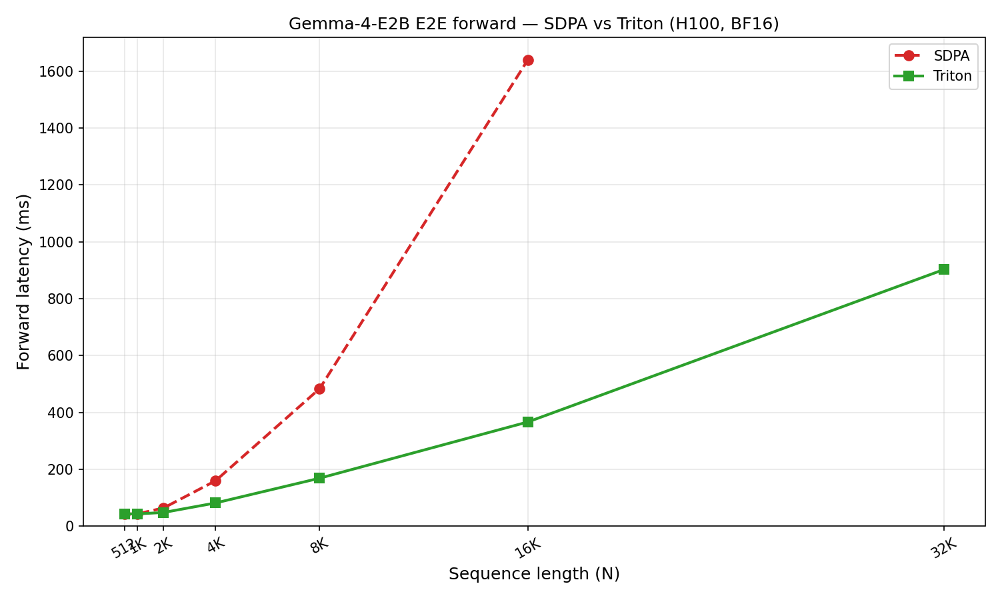
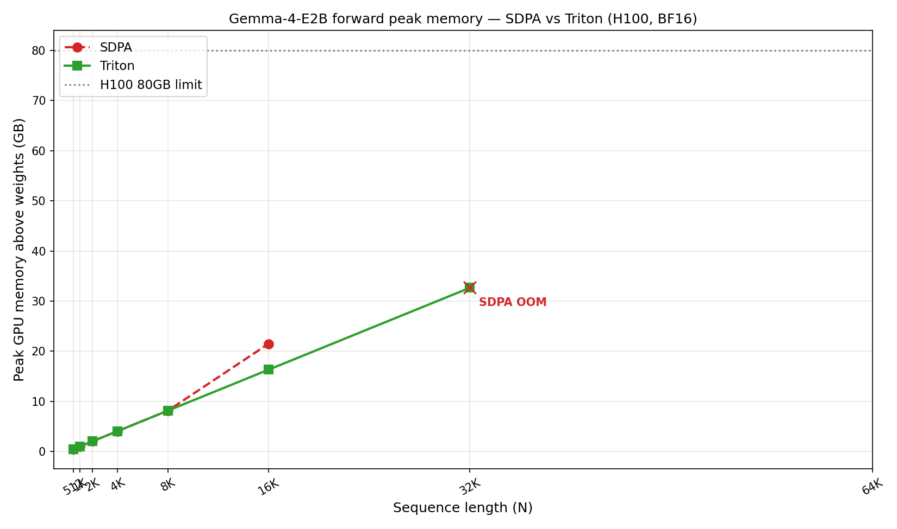

# gemma-triton-flash-attn

Drop-in Triton Flash Attention for HuggingFace transformers. One function
call replaces the attention kernel in every layer of your model — no
subclassing, no model surgery.

Optimised for **Gemma4-style models** (GQA with alternating **full causal**
`HEAD_DIM=512` and **sliding window** `HEAD_DIM=256` layers), where SDPA's
cuDNN / FlashAttention-3 paths either miss the config or lack SWA support.

## Results at a glance (H100, single GPU)

| Benchmark | Config | Peak speedup / saving |
|-----------|--------|-----------------------|
| **Kernel fwd** (full causal, D=512, GQA 8:1) | N=32K, FP16 | **2.18× vs SDPA** |
| **Kernel fwd+bwd** (full causal, D=512, GQA 8:1) | N=2K, FP16 | **2.94× vs SDPA** (≥2.43× across all N) |
| **Gemma-4-E2B E2E forward** | N=16K, BF16 | **4.47× vs SDPA** |
| **Peak memory** (Gemma-4-E2B fwd) | N=16K, BF16 | **-24%** (22.0 GB → 16.7 GB) |
| **Max runnable context** (Gemma-4-E2B, 80 GB H100) | — | **32K vs 16K** (SDPA OOMs at 32K) |
| (bonus) Kernel fwd **D=128** GQA 4:1 | N=32K, FP16 | **1.31× vs SDPA** (421 TFLOPS/s) |
| (bonus) Kernel fwd **D=256 SWA** slide=1024 | N=32K, FP16 | **18.3× vs SDPA** |

### Speed — full causal attention (the SDPA slow-path config)



Gemma4's global attention layer uses `HEAD_DIM=512, H_Q=32, H_KV=4`, which
falls off SDPA's cuDNN / FlashAttention-3 fast-paths — effective throughput
caps at ~100 TFLOPS/s on the forward pass and ~50 TFLOPS/s on fwd+bwd. Our
Triton kernel doubles that to ~190 TFLOPS/s fwd (2.18× @ N=32K) and ~115
TFLOPS/s fwd+bwd (**peak 2.94× @ N=2K**, ≥2.43× at every sequence length).
Fwd+bwd wins are larger because the softmax+rescale work (where `exp2`
helps most) is a bigger fraction of the backward dQ / dKV kernels.

Both implementations are charged for the same dense-causal FLOPs
(`2·B·H·N²·D` fwd, `7·B·H·N²·D` fwd+bwd) — speedup ratios in ms and TFLOPS
match exactly. Attention is memory-bandwidth-bound, so both curves sit well
below the 990 TFLOPS H100 ceiling; the win is in how tightly we schedule
HBM traffic.

The kernel uses `tl.math.exp2` (folded `log2(e)` into the softmax scale) and
a split-loop causal mask (off-diagonal blocks skip the mask op entirely) —
both borrowed from FA2. At D=128 this lifts us past SDPA to 421 TFLOPS/s;
at D=512 the matmul is already dominant so the softmax optimizations are
worth only a few percent. See [`docs/optimization_notes.md`](docs/optimization_notes.md).



Short N is dominated by linear projections (35 layers × 4 projs each);
attention becomes the bottleneck once N ≥ 2K, where the Triton kernel
widens the gap.

### Memory



At short N both paths are tied (SDPA uses its own flash backend). At
N=16K SDPA starts materialising attention scratch and Triton saves 5.3 GB;
at N=32K SDPA runs out of memory entirely while Triton still fits in
33 GB above the model weights.

## Quickstart: swap attention in 3 lines

```python
from gemma_triton_flash_attn import register_triton_attention
from transformers import AutoModelForCausalLM

register_triton_attention()                                   # 1. register "triton_gqa"
model = AutoModelForCausalLM.from_pretrained(
    "google/gemma-4-E2B", dtype="bfloat16", device_map="cuda")
model.config._attn_implementation = "triton_gqa"              # 2. opt in
if hasattr(model.config, "text_config"):                      # 3. opt in nested configs
    model.config.text_config._attn_implementation = "triton_gqa"

# Every attention layer now uses the Triton kernel. Forward / backward / generate
# all continue to work — the rest of the transformers stack is untouched.
out = model(input_ids)
```

**transformers 5.5.4 users**: call
`patch_transformers_5_5_4_flash_attn_key()` once before any config load to
work around the upstream `KeyError: 'flash_attn'` bug
([details](docs/integration.md#transformers-554-keyerror-workaround)).

## Why this package

PyTorch SDPA (cuDNN / FlashAttention-3) is heavily optimised for standard
`HEAD_DIM` values (64, 128, 256). Gemma4's two attention variants fall
outside the fast path:

| Config | HEAD_DIM | H_Q / H_KV | GQA ratio | SDPA status |
|--------|----------|------------|-----------|-------------|
| Full causal (Gemma4 global) | **512** | 32 / 4 | 8:1 | generic fallback, slow |
| Sliding (Gemma4 local) | 256 | 32 / 16 | 2:1 | fast at short N, **no SWA support** |

For models that alternate these (Gemma4, MoE hybrids), this kernel is
typically 1.3×–4.5× faster end-to-end on H100.

## Installation

```bash
git clone <repo>
cd kernel
pip install -e .
```

Requires: `torch>=2.0`, `triton>=3.0`, CUDA GPU (tested on H100).

For the integration tests (real Gemma-4-E2B download):

```bash
pip install -r requirements.txt          # transformers 5.5.4, accelerate, etc.
```

## Running the tests

```bash
# 1) Adapter unit test — 24 cases (GQA × SWA × D), seconds
python tests/gemma4_integration/test_adapter.py

# 2) Real Gemma-4-E2B end-to-end — downloads 5 GB on first run
export HF_TOKEN="hf_..."                  # Gemma is gated on HF
python tests/gemma4_integration/test_gemma4.py --seq-len 1024
```

Full test matrix and expected outputs: [`docs/tests.md`](docs/tests.md).

## What it does NOT support

- Variable-length sequences / padding mask
- ALiBi or positional bias injection
- `softcap` (raises `NotImplementedError` in the adapter)
- Attention dropout
- `HEAD_DIM` outside 64–512 range
- Devices other than CUDA

## Documentation

| Topic | File |
|-------|------|
| How the HF adapter works | [`docs/integration.md`](docs/integration.md) |
| Public API reference | [`docs/api.md`](docs/api.md) |
| Architecture & kernel map | [`docs/architecture.md`](docs/architecture.md) |
| Optimisation notes (wins + dead ends) | [`docs/optimization_notes.md`](docs/optimization_notes.md) |
| Test suite | [`docs/tests.md`](docs/tests.md) |

## Reproducing the benchmarks

```bash
export HF_TOKEN="hf_..."
python benchmarks/run_final_benchmark.py       # 30-min run, produces results.json + 3 PNGs
python benchmarks/replot.py                    # regenerate plots from cached data
```

Raw numbers live in [`benchmarks/results.json`](benchmarks/results.json).
